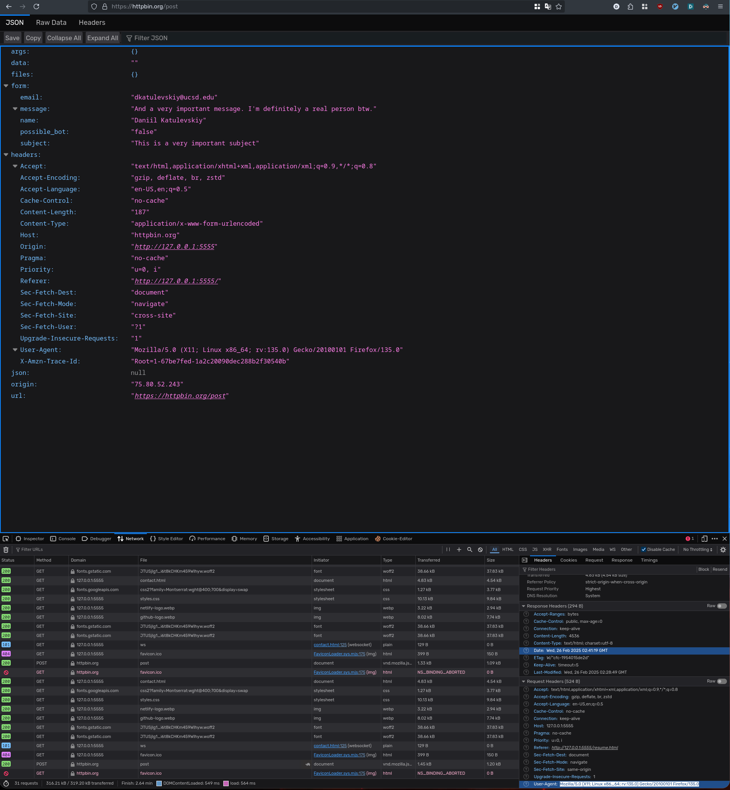

# HW4 Part 1

## POST REQUEST

POST /post HTTP/1.1
Host: httpbin.org
User-Agent: Mozilla/5.0 (X11; Linux x86_64; rv:135.0) Gecko/20100101 Firefox/135.0
Date: Wed, 26 Feb 2025 02:41:19 GMT
Content-Type: application/x-www-form-urlencoded
Content-Length: 134

name=Daniil+Katulevskiy&email=daniil%40example.com&message=This+is+a+test%21&possible_bot=false

Httpbin screenshot:

Layout with info and error fields used

Layout without errors

Httpbin shows errors captured by JS

Improved version is form-with-js.html, and now is also integrated into contact.html

Original no-js version is form-no-js.html

Theme switcher is in the top right corner on every page, just click sun/moon logo.

Static astro website link is in the links section lower.

## LINKS:

Original website:

https://katul-portfolio2.netlify.app/

Static astro website:

https://katul-static.netlify.app/

Github repo:

https://github.com/katulevskiy/cse134-hw4
